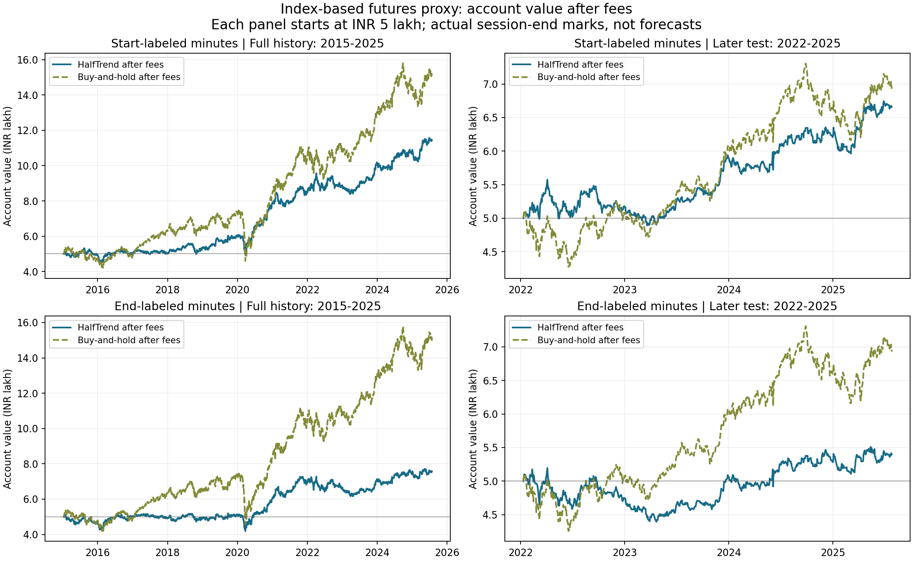
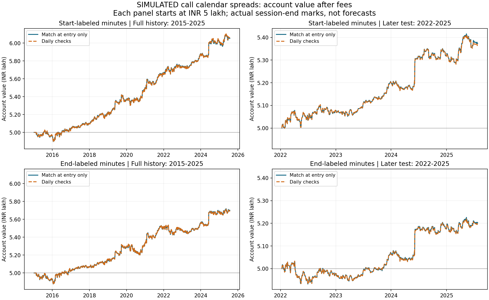

# HalfTrend research on NIFTY 50

This project asks a simple question: **would following HalfTrend's buy and sell
signals have worked after trading costs?** It studies historical NIFTY 50 prices
from January 2015 to July 2025. It is a research project, not a live trading system.

HalfTrend is a trend-following indicator. Here, the strategy buys when it turns
bullish and exits when it turns bearish. It does not take bearish short positions.
Signals use completed 15-minute candles; trades happen at the next available
candle's opening price. The main setting is amplitude 3, channel deviation 2.

**Primary research uses start-labeled minutes**, confirmed by the repository
owner's personal comparison with TradingView. End-labeled results are retained
as an alternative candle-grouping robustness test, not the dataset's actual convention.

**Overall finding:** costs reduce the apparent profits substantially. The primary
futures proxy earned 33.16% after fees in the later period, versus 38.56% for
buy-and-hold, with a smaller largest drop. The simulated
option spreads show small drawdowns, but their profits do not survive all the
cost and pricing assumptions. We have not established a dependable live-trading edge.

## How to read the results

- **Net return** is the total gain or loss after the modeled fees. It is not an
  annual return. Annual growth spreads that result over the actual elapsed years.
- **Largest drop**, also called maximum drawdown, is the biggest fall from a
  previous account-value peak. Starting capital is included as the first peak.
- **Buy-and-hold** means buying the NIFTY price-index equivalent at the beginning
  and holding it. This comparison excludes dividends.
- **Start-labeled / end-labeled** means a timestamp identifies the beginning or
  end of its minute. **Start-labeled is the confirmed primary convention**: 09:15
  represents the minute starting at 09:15. End-labeled results deliberately use
  an alternative grouping to test sensitivity, with their own matching benchmark
  dates. Primary status follows the TradingView check, not which result is better.
- **Earlier period (IS):** January 2015-January 2022. **Later period (OOS):** January
  2022-July 2025. The later period was examined previously, so it is not a fresh,
  untouched test. Each period starts with a fresh account; the full-history run
  carries its account through the whole period.

## Stage 1: fix the data and calculations

Stage 1 repaired the research process. It was **not a full strategy evaluation**.

| Problem found | What changed |
| --- | --- |
| Dates could be misread | Dates now use day-month-year and Indian local time |
| Four timestamps had conflicting prices | The eight conflicting rows are recorded and explicitly excluded in the research runs |
| Incomplete and evening candles could enter the test | The runs use complete, regular-session candles only |
| Annual returns and trading fees were inconsistent | Growth uses real elapsed time; fees use each actual purchase and sale |
| Trade records did not agree with account value | Cash, holdings, fees and trade records now reconcile independently |
| Later-period signals could lose earlier history | Indicators retain earlier history and are checked against future-data changes |

A small verification sample used only the **first 1,000 retained candles**, from
January 9 to March 11, 2015, with start-labeled minutes:

| Verification sample | Result |
| --- | ---: |
| Starting account | INR 100,000 |
| Ending account, after fees | INR 98,491.96 |
| Net loss | INR 1,508.04 (-1.51%) |
| Completed trades | 16 |
| Total modeled fees, already deducted | INR 1,597.52 |
| Difference between independently checked and recorded account value | INR 0 |
| Tests passing at Stage 1 completion | 85 |

This sample checks that the calculations work; it does not establish long-term
profitability. Earlier result files were preserved rather than presented as
corrected results.

[Stage 1 correction report](DISCREPANCY_RESOLUTION.md) |
[Sample verification evidence](verification/discrepancy_fix/real_data_verification.json)

## Stage 2: index-based futures proxy

This is a **simulation using index prices as a futures proxy**, not a backtest
using actual futures contracts. Each run starts with **INR 500,000 (5 lakh)**.
It uses no borrowing or leverage, allows fractional research units, and keeps the
quantity fixed until the trade closes. Idle cash earns nothing.

The main fee is **5 bps per side = 0.05% of the underlying trade value**, on both
entry and exit. The main run assumes no extra price disadvantage when filling
orders; separate tests add that disadvantage, called slippage.

### Before fees, after fees, and buy-and-hold

| Research case | Period | HalfTrend before fees | HalfTrend after fees | Buy-and-hold after fees | HalfTrend largest drop, after fees |
| --- | --- | ---: | ---: | ---: | ---: |
| **Primary (start)** | Earlier | 282.30% | 71.61% | 114.95% | 18.28% |
| **Primary (start)** | Later | 98.66% | 33.16% | 38.56% | 12.61% |
| **Primary (start)** | Full history | 659.47% | 128.52% | 199.56% | 18.28% |
| Robustness test (end) | Earlier | 205.64% | 40.10% | 114.73% | 20.70% |
| Robustness test (end) | Later | 61.09% | 7.98% | 38.55% | 15.76% |
| Robustness test (end) | Full history | 392.34% | 51.29% | 199.41% | 20.70% |

### What happened to INR 5 lakh in the later period?

| Research case | Net profit | Ending account | Annual growth | Total fees | Completed trades |
| --- | ---: | ---: | ---: | ---: | ---: |
| **Primary (start)** | INR 165,819.57 | INR 665,819.57 | 8.43% | INR 224,248.57 | 400 |
| Robustness test (end) | INR 39,900.86 | INR 539,900.86 | 2.19% | INR 197,014.71 | 400 |

Fees are already deducted from profit. They accumulate across hundreds of trades;
5 bps is not a one-time charge on starting capital. The difference between the
before-fee and after-fee runs also includes changes in later account sizes and
compounding, so that difference is not simply the fees paid.

The primary HalfTrend run earned less than buy-and-hold, but experienced a smaller
drop: **12.61% versus 17.12%** in the later period. Average profit per completed
HalfTrend trade was about **INR 415**. The end-labeled robustness test also earned
less than its benchmark, with average trade profit of about **INR 100**.

Adding two index points of adverse slippage per fill lowered later-period returns
to **22.87% in the primary run** and **-0.39% in the end-labeled robustness test**.
The primary run remained profitable under this stress; the alternative grouping
was more fragile. This shows sensitivity to alternative candle grouping.
The five best completed trades accounted for about 68% of net profit with start
labels; with end labels they exceeded the entire net profit because other trades
lost money overall. This describes concentration, not a rerun with those trades removed.

**Stage 2 verdict:** the primary later-period run was profitable after the modeled
fees and tested slippage, but returned less than buy-and-hold. The alternative
grouping shows sensitivity, and execution costs reduce profits materially.
Actual futures prices, contract changes, funding, lot sizes and margin requirements
were not verified, so these results do not establish executable futures performance.

### Futures-proxy equity curves

These show account value after fees, using the last available value each session.
Each panel starts at INR 5 lakh. Full history and the later test are separate runs.
Start-labeled panels are primary; end-labeled panels are the robustness test.
Both cases use the same vertical scale within each period. Charts are unchanged.

[](docs/images/futures_proxy_equity.png)

[Full Stage 2 report, annual results and sensitivity tests](results/stage2_futures_proxy_20261007_completed/REPORT.md)

## Stage 3: SIMULATED bullish call calendar spreads

Instead of holding index exposure directly, this strategy **buys a longer-dated
call and sells a shorter-dated call at the same strike**. A call benefits from a
rise in the underlying price, although the combined spread's behavior is more
complex. Every position has both legs; there is no standalone long-call strategy.

The amounts are chosen to approximately balance the options' expected daily time
loss under the pricing model. This is called **theta matching**. It is checked at
entry; a separate version checks once each session and adjusts when the imbalance
becomes large. It is not permanently neutral or risk-free.

Option prices are **SIMULATED**, using historical index prices and a mathematical
pricing model. The main scenario uses approximate 60/30-day maturities, volatility
at 1.2 times the previous 21 sessions' estimate, 6% pricing interest rate and 1%
dividend yield. These are assumptions, not observed option prices or market IV.

Each run starts with INR 5 lakh. The bought call's premium plus both entry fees
cannot exceed 5% of account value. Cash equal to the sold units times the strike
is reserved as conservative collateral; it stays in account value and is not
counted twice. Research units are integers, not exchange lots. Idle cash earns zero.

### Later-period results after fees

| Research case | Entry-only net profit | Entry-only return | Daily-check return | Largest drop, both versions | Entry-only total fees |
| --- | ---: | ---: | ---: | ---: | ---: |
| **Primary (start)** | INR 37,386.17 | 7.48% | 7.31% | 1.54% | INR 5,791.11 |
| Robustness test (end) | INR 20,245.94 | 4.05% | 3.96% | 2.11% | INR 5,689.42 |

The main fee is **3 bps per side = 0.03% of each leg's premium value**, with no
primary slippage. The study also tests 2 bps fees and 10/25 bps adverse premium
slippage. For example, a fill worth INR 10,000 in premium incurs INR 3 at 3 bps.
Fees apply to purchases, sales and adjustments, not to the index value here.
These are research cost assumptions, not an all-inclusive broker/tax quotation.

Matching time decay improved primary return compared with equal quantities of the
two calls, but increased drawdown. Daily adjustments slightly worsened the primary
later-period result. Primary annual growth was only about **2.1%**; the end-labeled
robustness test was about **1.1%**. Both were below the 6% comparison rate used for
the risk ratios. Smaller drawdowns partly reflect
much lower directional exposure than the futures proxy; this is not an equal-risk
comparison.

At 25 bps adverse premium slippage, the primary run and end-labeled robustness
test both lost money. Changing the assumed volatility relationship between the
two maturities also materially affected profits. Positive directional exposure
is required at entry
and adjustment, but any subsequent drift is recorded rather than hidden.

**Stage 3 verdict: inconclusive robustness.** Real premiums, volatility across
maturities, bid/ask spreads, liquidity, expiries, exchange lots and broker margin
remain unverified. Historical positions did not reach a roll; roll and expiry-gap
handling were verified with synthetic tests.

### Simulated-option equity curves

Solid lines match at entry only; dashed lines use daily checks. They often overlap
because the differences are small. Account value includes both the bought option
and the liability from the sold option, after fees.
The option charts use a different vertical scale from the futures-proxy charts.
Start-labeled panels are primary; end-labeled panels are the robustness test.
The saved charts and underlying results have not been recalculated.

[](docs/images/simulated_calendar_equity.png)

[Full SIMULATED Stage 3 report and sensitivity tests](results/stage3_SIMULATED_calendars_20261007_completed/REPORT.md)

## Data and measurement rules

- Source: the local Kaggle-derived `NIFTY_50_minute.csv`; no market downloads.
  The raw CSV remains unchanged. Conflicting rows are audited; the loader rejects
  them by default and research runs explicitly exclude them.
- Regular hours are 09:15-15:30, Asia/Kolkata: normally **25 complete 15-minute
  candles**. Incomplete candles and evening observations are excluded. Missing
  prices are not invented. Zero volume means volume information is unavailable.
- The primary start-labeled dataset retains 64,951 candles. The end-labeled
  robustness test retains 62,349 because the alternative grouping changes which
  candles are complete. Each case uses its own matching buy-and-hold observations.
  Start-label confirmation comes from the owner's personal TradingView check.
- Indicators and volatility estimates use only information available at the time.
  The earlier and later tests start without positions or pending earlier signals.
  Positions still open at the end are valued at the last price, not forced closed.
- Annual growth uses actual elapsed calendar time. Risk ratios use daily account
  changes and 252 sessions/year. Their annual comparison rate is 0% in Stage 2 and
  6% in Stage 3; additional zero-rate Stage 3 ratios are saved. Undefined ratios
  are reported as unavailable, not replaced with zero. Detailed calculation
  conventions are in the stage reports and source code.

## Reproduce the research

Run from the repository root with the project's Python dependencies installed.
Use a **new output directory** for each research run; existing directories are
rejected. Change the data path to your local CSV location if needed.

```powershell
python -m src.futures_proxy --data "C:/Users/beqmd/Documents/QuantResearch/data/NIFTY_50_minute.csv" --output results/stage2_futures_proxy_repeat
python -m src.simulated_calendars --data "C:/Users/beqmd/Documents/QuantResearch/data/NIFTY_50_minute.csv" --output results/stage3_simulated_calendars_repeat
```

Recreate the README charts from saved results, without rerunning the strategies
(requires Matplotlib):

```powershell
python scripts/plot_equity_curves.py
```

## Verification

At each stage's completion: **85 tests passed in Stage 1, 103 in Stage 2, and 129
in Stage 3**. All 60 Stage 2 runs and all 180 Stage 3 runs were independently
checked against their trade records and account values. Stage 3 option prices
and sensitivities were also independently recalculated. Future-data changes did
not change earlier signals, trades or account values. Ruff and Black checks passed.

```powershell
python -m pytest -q
python -m ruff check .
python -m black --check .
python -m tests.verify_futures_proxy_outputs results/stage2_futures_proxy_20261007_completed
python -m tests.verify_simulated_calendar_outputs results/stage3_SIMULATED_calendars_20261007_completed
```

Detailed trade records, account curves, fees, assumptions and verification logs
are saved with the completed stage reports. Older result files and clearly marked
incomplete attempts remain historical records; they are not the headline results.
The stage reports remain as originally written; this README reflects the later
TradingView confirmation. No results or charts were recalculated for this update.
